# System Architecture Analysis

## Overview

- **Project**: /home/tom/github/semcod/www
- **Primary Language**: javascript
- **Languages**: javascript: 102, python: 100, shell: 6
- **Analysis Mode**: static
- **Total Functions**: 1198
- **Total Classes**: 93
- **Modules**: 208
- **Entry Points**: 960

## Architecture by Module

### frontend.src.api
- **Functions**: 91
- **File**: `api.js`

### backend.db_module.wrappers
- **Functions**: 37
- **File**: `wrappers.py`

### e2e.specs.marketplace-flow.spec
- **Functions**: 37
- **File**: `marketplace-flow.spec.js`

### e2e.specs.social-sharing.spec
- **Functions**: 33
- **File**: `social-sharing.spec.js`

### frontend.e2e.system-integration.spec
- **Functions**: 27
- **File**: `system-integration.spec.js`

### examples.python-sdk.auto_pr_client
- **Functions**: 26
- **Classes**: 4
- **File**: `auto_pr_client.py`

### backend.db_module.tickets_orm
- **Functions**: 25
- **File**: `tickets_orm.py`

### backend.adapters.github
- **Functions**: 22
- **Classes**: 1
- **File**: `github.py`

### backend.adapters.gitlab
- **Functions**: 21
- **Classes**: 1
- **File**: `gitlab.py`

### backend.adapters.gitea
- **Functions**: 21
- **Classes**: 1
- **File**: `gitea.py`

### frontend.src.hooks.useUrlState
- **Functions**: 21
- **File**: `useUrlState.js`

### frontend.src.hooks.useDownloads
- **Functions**: 21
- **File**: `useDownloads.js`

### frontend.e2e.marketplace-flow.spec
- **Functions**: 20
- **File**: `marketplace-flow.spec.js`

### backend.adapters.base
- **Functions**: 19
- **Classes**: 1
- **File**: `base.py`

### e2e.gitea-oauth-cycle.spec
- **Functions**: 19
- **File**: `gitea-oauth-cycle.spec.js`

### e2e.specs.auth-flow.spec
- **Functions**: 19
- **File**: `auth-flow.spec.js`

### backend.services.analyzer
- **Functions**: 18
- **File**: `analyzer.py`

### frontend.e2e.benchmark.spec
- **Functions**: 18
- **File**: `benchmark.spec.js`

### e2e.specs.customer-journey.spec
- **Functions**: 17
- **File**: `customer-journey.spec.js`

### backend.services.billing
- **Functions**: 16
- **Classes**: 3
- **File**: `billing.py`

## Key Entry Points

Main execution flows into the system:

### backend.alembic.versions.0001_initial_schema.upgrade
- **Calls**: op.get_bind, sa.inspect, set, op.create_table, op.create_index, op.create_table, op.create_table, op.create_index

### backend.routers.audit.analyze_repo
> Analyze any public repository by URL (sandbox mode). Supports file:// for local repos.
- **Calls**: router.post, body.get, body.get, repo_url.startswith, backend.db_module.scans.save_audit_result, backend.routers.audit._schedule_background_task, request.json, HTTPException

### backend.routers.tickets.redsl.process_ticket_with_redsl
> Process ticket with reDSL engine to auto-generate PR.

Flow:
  1. Analyze ticket description with reDSL decide()
  2. Run reDSL refactor() on identifi
- **Calls**: router.post, Depends, Depends, backend.db_module.tickets_orm.get_ticket, backend.routers.tickets.models._get_tenant_for_user, user.get, backend.db_module.tickets_orm.update_ticket, HTTPException

### backend.db_module.scans_orm.save_audit_result
> Save audit result to database. Merges benchmark meta into audit_meta JSON.
- **Calls**: None.first, db.commit, audit_data.get, audit_data.get, audit_data.get, audit_data.get, audit_data.get, json.dumps

### backend.scripts.scan_samples.scan_sample_projects
> Scan all sample projects and save to database.
- **Calls**: backend.sample_projects.get_sample_projects, print, print, enumerate, print, print, print, sum

### backend.routers.metrics.get_standard_metrics
> Get standardized metrics for recent scans.
This endpoint provides a consistent format for remote clients.

Response format:
{
    "meta": {
        "g
- **Calls**: router.get, backend.db_module.scans.get_recent_scans, backend.db_module.scans.get_total_scan_count, formatted_scans.append, HTTPException, None.lower, scan.get, backend.routers.metrics._utc_now_iso

### backend.services.mirror.MirrorService.sync_mirror
> Sync mirror by pulling latest changes from source and pushing to Gitea.
- **Calls**: config.source_repo.replace, tempfile.TemporaryDirectory, Path, self._get_source_adapter, GiteaAdapter, subprocess.run, subprocess.run, subprocess.run

### backend.quality_gate.main
- **Calls**: backend.quality_gate._parse_args, print, backend.quality_gate.collect_results, backend.quality_gate.build_snapshot, print, print, print, print

### backend.services.mirror.MirrorService.create_mirror
> Create new mirror by cloning source repo to Gitea.

Flow:
1. Clone source repo to temp directory
2. Create target repo in Gitea
3. Push to Gitea
4. Se
- **Calls**: config.source_repo.replace, tempfile.TemporaryDirectory, Path, self._get_source_adapter, GiteaAdapter, logger.info, subprocess.run, self._get_latest_commit

### backend.worker.tasks.scan.process_pr_event
> Process pull request event asynchronously.

Flow:
1. Parse event from dict
2. Get diff content
3. Run analysis
4. Comment results
- **Calls**: backend.worker._celery_stub.shared_task, Event, backend.worker.tasks.scan._get_token_for_provider, backend.services.webhook_service.get_adapter_for_event, asyncio.run, asyncio.run, backend.worker.tasks.scan._format_pr_comment, asyncio.run

### frontend.e2e.github-login-sim.spec.FRONTEND_URL
- **Calls**: frontend.e2e.github-login-sim.spec.describe, frontend.e2e.github-login-sim.spec.beforeAll, frontend.e2e.github-login-sim.spec.get, frontend.e2e.github-login-sim.spec.expect, frontend.e2e.github-login-sim.spec.ok, frontend.e2e.github-login-sim.spec.toBeTruthy, frontend.e2e.github-login-sim.spec.json, frontend.e2e.github-login-sim.spec.toBe

### frontend.e2e.github-login-sim.spec.MOCK_GITHUB_URL
- **Calls**: frontend.e2e.github-login-sim.spec.describe, frontend.e2e.github-login-sim.spec.beforeAll, frontend.e2e.github-login-sim.spec.get, frontend.e2e.github-login-sim.spec.expect, frontend.e2e.github-login-sim.spec.ok, frontend.e2e.github-login-sim.spec.toBeTruthy, frontend.e2e.github-login-sim.spec.json, frontend.e2e.github-login-sim.spec.toBe

### frontend.e2e.github-login-sim.spec.BACKEND_URL
- **Calls**: frontend.e2e.github-login-sim.spec.describe, frontend.e2e.github-login-sim.spec.beforeAll, frontend.e2e.github-login-sim.spec.get, frontend.e2e.github-login-sim.spec.expect, frontend.e2e.github-login-sim.spec.ok, frontend.e2e.github-login-sim.spec.toBeTruthy, frontend.e2e.github-login-sim.spec.json, frontend.e2e.github-login-sim.spec.toBe

### backend.routers.marketplace.publish.install_app
> Install Semcod app on a repository.

This:
1. Creates/gets tenant
2. Creates/gets repository
3. Stores installation in DB
4. Sets up webhook on the pr
- **Calls**: router.post, Depends, str, backend.db_module.tenants_orm.get_or_create_tenant, request.repo.split, backend.db_module.repositories_orm.get_or_create_repository, backend.db_module.installations.create_installation, InstallResponse

### backend.worker.tasks.autopr.create_auto_pr
> Create automated PR with fixes asynchronously.

Similar to autopr router but as async task.
- **Calls**: backend.worker._celery_stub.shared_task, adapter_map.get, adapter_class, asyncio.run, asyncio.run, asyncio.run, asyncio.run, adapter.get_default_branch

### backend.routers.trend.get_scan_diff
> Compare the latest scan against the previous one for a repository.

Returns delta metrics and ranked improvement proposals.
Each auto-fixable proposal
- **Calls**: router.get, backend.db_module.scans.get_repo_scans, None.get, None.get, None.get, None.get, None.get, None.get

### backend.routers.autopr.create_redsl_auto_pr
> Use reDSL engine to analyze and refactor a project, then create a PR.

Flow:
  1. Check reDSL engine availability
  2. Run reDSL refactor (dry_run=Fal
- **Calls**: router.post, Depends, user.get, RedslClient, HTTPException, redsl.health, RedslRefactorResult, backend.services.autopr_helpers.generate_fix_id

### e2e.gitea-oauth-cycle.spec.FRONTEND_URL
- **Calls**: e2e.gitea-oauth-cycle.spec.describe, e2e.gitea-oauth-cycle.spec.test, e2e.gitea-oauth-cycle.spec.get, e2e.gitea-oauth-cycle.spec.expect, e2e.gitea-oauth-cycle.spec.ok, e2e.gitea-oauth-cycle.spec.toBeTruthy, e2e.gitea-oauth-cycle.spec.from, e2e.gitea-oauth-cycle.spec.toString

### e2e.gitea-oauth-cycle.spec.GITEA_URL
- **Calls**: e2e.gitea-oauth-cycle.spec.describe, e2e.gitea-oauth-cycle.spec.test, e2e.gitea-oauth-cycle.spec.get, e2e.gitea-oauth-cycle.spec.expect, e2e.gitea-oauth-cycle.spec.ok, e2e.gitea-oauth-cycle.spec.toBeTruthy, e2e.gitea-oauth-cycle.spec.from, e2e.gitea-oauth-cycle.spec.toString

### e2e.gitea-oauth-cycle.spec.BACKEND_URL
- **Calls**: e2e.gitea-oauth-cycle.spec.describe, e2e.gitea-oauth-cycle.spec.test, e2e.gitea-oauth-cycle.spec.get, e2e.gitea-oauth-cycle.spec.expect, e2e.gitea-oauth-cycle.spec.ok, e2e.gitea-oauth-cycle.spec.toBeTruthy, e2e.gitea-oauth-cycle.spec.from, e2e.gitea-oauth-cycle.spec.toString

### backend.services.autofix.AutoFixService.create_auto_fix_pr
> Create automated PR with fixes.

Flow:
1. Generate patches from analysis
2. Create new branch
3. Apply patches as commits
4. Create PR
- **Calls**: self.patch_generator.analyze_and_generate_patches, self.patch_generator.generate_fix_description, FixResult, FixResult, self.adapter.get_ref_sha, None.hexdigest, self.adapter.create_branch, FixResult

### backend.db_module.schema.init_db
> Initialize the database and create tables.
- **Calls**: backend.db_module.db_connection.get_connection, conn.cursor, cursor.execute, cursor.execute, cursor.execute, cursor.execute, cursor.execute, cursor.execute

### backend.routers.audit.run_audit
> Run one-click audit on a repo. Requires authentication.
- **Calls**: router.post, Depends, backend.db_module.scans.save_audit_result, backend.routers.audit._schedule_background_task, request.json, None.hexdigest, body.get, body.get

### backend.routers.autopr.create_auto_pr
> Apply LLM-generated patches to a repository and create a GitHub PR.

Flow:
  1. Create branch feat/semcod-fix-{id}
  2. Commit each patch file
  3. Ch
- **Calls**: router.post, Depends, user.get, backend.services.autopr_helpers.generate_fix_id, backend.db_module.scans.get_repo_scans, HTTPException, backend.routers.autopr._check_rollback, backend.routers.autopr._score_improved

### backend.routers.auth.gitea_oauth_callback
> Step 2: Exchange code for token, fetch profile, create user, issue JWT.
- **Calls**: router.get, token_data.get, profile_resp.json, profile.get, backend.db_module.users.upsert_user, backend.routers.auth.create_session_token, RedirectResponse, HTTPException

### backend.adapters.gitlab.GitLabAdapter.get_pr_files
> Get list of files changed in MR.
- **Calls**: self._get_project_path, resp.json, data.get, httpx.AsyncClient, HTTPException, client.get, c.get, c.get

### backend.routers.auth.github_oauth_callback
> Step 2: Exchange code for token, fetch profile, create user, issue JWT.
- **Calls**: router.get, token_data.get, profile_resp.json, profile.get, backend.db_module.users.upsert_user, backend.routers.auth.create_session_token, RedirectResponse, httpx.AsyncClient

### backend.db_module.repositories.get_or_create_repository
> Get existing repository or create new one for tenant.
- **Calls**: backend.db_module.db_connection.get_connection, conn.cursor, cursor.execute, cursor.fetchone, None.isoformat, None.join, cursor.execute, conn.commit

### backend.routers.webhook.github_webhook
> Handle GitHub webhook events.
- **Calls**: router.post, request.headers.get, request.headers.get, json.loads, request.body, payload.get, payload.get, None.hexdigest

### backend.routers.metrics.get_metrics_summary
> Get summary statistics of all scans.
Useful for dashboards and monitoring.
- **Calls**: router.get, backend.db_module.scans.get_recent_scans, sum, sum, sum, len, HTTPException, grade_dist.get

## Process Flows

Key execution flows identified:

### Flow 1: upgrade
```
upgrade [backend.alembic.versions.0001_initial_schema]
```

### Flow 2: analyze_repo
```
analyze_repo [backend.routers.audit]
  └─ →> save_audit_result
      └─ →> get_connection
```

### Flow 3: process_ticket_with_redsl
```
process_ticket_with_redsl [backend.routers.tickets.redsl]
  └─ →> get_ticket
      └─> _ticket_to_dict
  └─ →> _get_tenant_for_user
      └─ →> get_or_create_tenant
```

### Flow 4: save_audit_result
```
save_audit_result [backend.db_module.scans_orm]
```

### Flow 5: scan_sample_projects
```
scan_sample_projects [backend.scripts.scan_samples]
  └─ →> get_sample_projects
```

### Flow 6: get_standard_metrics
```
get_standard_metrics [backend.routers.metrics]
  └─ →> get_recent_scans
      └─ →> get_connection
  └─ →> get_total_scan_count
      └─ →> get_connection
```

### Flow 7: sync_mirror
```
sync_mirror [backend.services.mirror.MirrorService]
```

### Flow 8: main
```
main [backend.quality_gate]
  └─> _parse_args
  └─> collect_results
      └─> _should_exclude
      └─> analyze_file
```

### Flow 9: create_mirror
```
create_mirror [backend.services.mirror.MirrorService]
```

### Flow 10: process_pr_event
```
process_pr_event [backend.worker.tasks.scan]
  └─> _get_token_for_provider
  └─ →> shared_task
  └─ →> get_adapter_for_event
```

## Key Classes

### backend.adapters.gitlab.GitLabAdapter
> GitLab API implementation of GitProvider.
- **Methods**: 22
- **Key Methods**: backend.adapters.gitlab.GitLabAdapter.__init__, backend.adapters.gitlab.GitLabAdapter.provider_name, backend.adapters.gitlab.GitLabAdapter.get_api_headers, backend.adapters.gitlab.GitLabAdapter._get_project_path, backend.adapters.gitlab.GitLabAdapter.comment_on_pr, backend.adapters.gitlab.GitLabAdapter.update_pr_description, backend.adapters.gitlab.GitLabAdapter.create_pr, backend.adapters.gitlab.GitLabAdapter.close_pr, backend.adapters.gitlab.GitLabAdapter.create_branch, backend.adapters.gitlab.GitLabAdapter.delete_branch
- **Inherits**: GitProvider

### backend.adapters.gitea.GiteaAdapter
> Gitea API implementation of GitProvider.

Gitea API is compatible with GitHub API v3 in most places,
- **Methods**: 22
- **Key Methods**: backend.adapters.gitea.GiteaAdapter.__init__, backend.adapters.gitea.GiteaAdapter.provider_name, backend.adapters.gitea.GiteaAdapter.get_api_headers, backend.adapters.gitea.GiteaAdapter.comment_on_pr, backend.adapters.gitea.GiteaAdapter.update_pr_description, backend.adapters.gitea.GiteaAdapter.create_pr, backend.adapters.gitea.GiteaAdapter.close_pr, backend.adapters.gitea.GiteaAdapter.create_branch, backend.adapters.gitea.GiteaAdapter._create_branch_via_git, backend.adapters.gitea.GiteaAdapter.delete_branch
- **Inherits**: GitProvider

### backend.adapters.github.GitHubAdapter
> GitHub API implementation of GitProvider.
- **Methods**: 21
- **Key Methods**: backend.adapters.github.GitHubAdapter.__init__, backend.adapters.github.GitHubAdapter.provider_name, backend.adapters.github.GitHubAdapter.get_api_headers, backend.adapters.github.GitHubAdapter.comment_on_pr, backend.adapters.github.GitHubAdapter.update_pr_description, backend.adapters.github.GitHubAdapter.create_pr, backend.adapters.github.GitHubAdapter.close_pr, backend.adapters.github.GitHubAdapter.create_branch, backend.adapters.github.GitHubAdapter.delete_branch, backend.adapters.github.GitHubAdapter.commit_file
- **Inherits**: GitProvider

### backend.adapters.base.GitProvider
> Abstract base class for git platform integrations.

Provides unified interface for common operations
- **Methods**: 20
- **Key Methods**: backend.adapters.base.GitProvider.__init__, backend.adapters.base.GitProvider.comment_on_pr, backend.adapters.base.GitProvider.update_pr_description, backend.adapters.base.GitProvider.create_pr, backend.adapters.base.GitProvider.close_pr, backend.adapters.base.GitProvider.create_branch, backend.adapters.base.GitProvider.delete_branch, backend.adapters.base.GitProvider.commit_file, backend.adapters.base.GitProvider.get_default_branch, backend.adapters.base.GitProvider.get_ref_sha
- **Inherits**: ABC

### backend.services.mirror.MirrorService
> Service for mirroring repos to local Gitea.
- **Methods**: 11
- **Key Methods**: backend.services.mirror.MirrorService.__init__, backend.services.mirror.MirrorService.create_mirror, backend.services.mirror.MirrorService.sync_mirror, backend.services.mirror.MirrorService._get_source_adapter, backend.services.mirror.MirrorService._get_clone_url, backend.services.mirror.MirrorService._get_gitea_clone_url, backend.services.mirror.MirrorService._create_gitea_repo, backend.services.mirror.MirrorService._setup_ci_cd, backend.services.mirror.MirrorService._generate_workflow, backend.services.mirror.MirrorService._get_latest_commit

### backend.apps.base.AppBase
> Base class for all marketplace apps.

Apps must implement:
- run_pipeline() - main analysis logic
- 
- **Methods**: 11
- **Key Methods**: backend.apps.base.AppBase.__init__, backend.apps.base.AppBase.run_pipeline, backend.apps.base.AppBase.get_triggers, backend.apps.base.AppBase.get_actions, backend.apps.base.AppBase.on_pr_opened, backend.apps.base.AppBase.on_pr_synchronize, backend.apps.base.AppBase.on_push, backend.apps.base.AppBase.on_pr_comment, backend.apps.base.AppBase.is_enabled_for_repo, backend.apps.base.AppBase.get_pricing_tier
- **Inherits**: ABC

### examples.python-sdk.auto_pr_client.SemcodClient
> Semcod API client — authenticates via gh token exchange.
- **Methods**: 11
- **Key Methods**: examples.python-sdk.auto_pr_client.SemcodClient.__init__, examples.python-sdk.auto_pr_client.SemcodClient._authenticate, examples.python-sdk.auto_pr_client.SemcodClient._request, examples.python-sdk.auto_pr_client.SemcodClient.create_ticket, examples.python-sdk.auto_pr_client.SemcodClient.get_tickets, examples.python-sdk.auto_pr_client.SemcodClient.process_ticket, examples.python-sdk.auto_pr_client.SemcodClient.get_ticket_status, examples.python-sdk.auto_pr_client.SemcodClient.get_ticket_stats, examples.python-sdk.auto_pr_client.SemcodClient.get_redsl_status, examples.python-sdk.auto_pr_client.SemcodClient.redsl_health

### backend.services.redsl_client.RedslClient
> HTTP client for the reDSL refactoring engine.
- **Methods**: 9
- **Key Methods**: backend.services.redsl_client.RedslClient.__init__, backend.services.redsl_client.RedslClient.analyze, backend.services.redsl_client.RedslClient.decide, backend.services.redsl_client.RedslClient.refactor, backend.services.redsl_client.RedslClient.batch_hybrid, backend.services.redsl_client.RedslClient.cycle, backend.services.redsl_client.RedslClient.clear_history, backend.services.redsl_client.RedslClient.health_score, backend.services.redsl_client.RedslClient.health

### backend.services.billing.UsageTracker
> Tracks usage per tenant for billing purposes.
- **Methods**: 9
- **Key Methods**: backend.services.billing.UsageTracker.__init__, backend.services.billing.UsageTracker.record_usage, backend.services.billing.UsageTracker.check_can_execute, backend.services.billing.UsageTracker.get_usage_report, backend.services.billing.UsageTracker._get_plan_limits, backend.services.billing.UsageTracker._get_current_month_usage, backend.services.billing.UsageTracker._store_usage_record, backend.services.billing.UsageTracker._calculate_cost, backend.services.billing.UsageTracker._event_type_to_limit_key

### backend.apps.registry.AppRegistry
> Central registry for all marketplace apps.

Handles:
- Loading apps from apps/ directory
- Event rou
- **Methods**: 8
- **Key Methods**: backend.apps.registry.AppRegistry.__init__, backend.apps.registry.AppRegistry.initialize, backend.apps.registry.AppRegistry.get_app, backend.apps.registry.AppRegistry.get_apps_for_event, backend.apps.registry.AppRegistry.process_event, backend.apps.registry.AppRegistry.list_apps, backend.apps.registry.AppRegistry.get_app_manifest, backend.apps.registry.AppRegistry._event_to_trigger

### backend.apps.audit.pipeline.AuditApp
> Main code quality audit app.

Analyzes:
- Cyclomatic complexity
- Code duplication
- Maintainability
- **Methods**: 8
- **Key Methods**: backend.apps.audit.pipeline.AuditApp.__init__, backend.apps.audit.pipeline.AuditApp.run_pipeline, backend.apps.audit.pipeline.AuditApp._detect_issues, backend.apps.audit.pipeline.AuditApp._calculate_score, backend.apps.audit.pipeline.AuditApp._generate_recommendations, backend.apps.audit.pipeline.AuditApp.get_triggers, backend.apps.audit.pipeline.AuditApp.get_actions, backend.apps.audit.pipeline.AuditApp._score_to_grade
- **Inherits**: AppBase

### examples.python-sdk.auto_pr_client.GhClient
> GitHub CLI wrapper — uses `gh` which has valid token.
- **Methods**: 8
- **Key Methods**: examples.python-sdk.auto_pr_client.GhClient.get_token, examples.python-sdk.auto_pr_client.GhClient.get_user, examples.python-sdk.auto_pr_client.GhClient.api, examples.python-sdk.auto_pr_client.GhClient.list_repos, examples.python-sdk.auto_pr_client.GhClient.create_pr, examples.python-sdk.auto_pr_client.GhClient.create_branch, examples.python-sdk.auto_pr_client.GhClient.commit_file, examples.python-sdk.auto_pr_client.GhClient.create_issue

### backend.apps.performance.pipeline.PerformanceApp
> Performance bottleneck analyzer.

Detects:
- Slow database queries (N+1)
- Memory leaks
- Inefficien
- **Methods**: 7
- **Key Methods**: backend.apps.performance.pipeline.PerformanceApp.__init__, backend.apps.performance.pipeline.PerformanceApp.run_pipeline, backend.apps.performance.pipeline.PerformanceApp._detect_performance_issues, backend.apps.performance.pipeline.PerformanceApp._calculate_score, backend.apps.performance.pipeline.PerformanceApp._get_recommendations, backend.apps.performance.pipeline.PerformanceApp.get_triggers, backend.apps.performance.pipeline.PerformanceApp.get_actions
- **Inherits**: AppBase

### backend.services.autofix.PatchGenerator
> Generates patches for common code issues.
- **Methods**: 5
- **Key Methods**: backend.services.autofix.PatchGenerator.__init__, backend.services.autofix.PatchGenerator.analyze_and_generate_patches, backend.services.autofix.PatchGenerator._parse_diff_original, backend.services.autofix.PatchGenerator._apply_fixes, backend.services.autofix.PatchGenerator.generate_fix_description

### backend.services.billing.StripeBilling
> Stripe integration for usage-based billing.
- **Methods**: 5
- **Key Methods**: backend.services.billing.StripeBilling.__init__, backend.services.billing.StripeBilling.create_customer, backend.services.billing.StripeBilling.create_subscription, backend.services.billing.StripeBilling.record_usage, backend.services.billing.StripeBilling.get_invoice_preview

### backend.worker._celery_stub._StubTask
> Wraps a plain function so it behaves like a bound Celery task in tests.
- **Methods**: 5
- **Key Methods**: backend.worker._celery_stub._StubTask.__init__, backend.worker._celery_stub._StubTask.__call__, backend.worker._celery_stub._StubTask.run, backend.worker._celery_stub._StubTask.delay, backend.worker._celery_stub._StubTask.retry

### backend.apps.security.pipeline.SecurityApp
> Security vulnerability scanner.

Detects:
- Hardcoded secrets (API keys, tokens)
- Vulnerable depend
- **Methods**: 5
- **Key Methods**: backend.apps.security.pipeline.SecurityApp.__init__, backend.apps.security.pipeline.SecurityApp.run_pipeline, backend.apps.security.pipeline.SecurityApp._get_recommendations, backend.apps.security.pipeline.SecurityApp.get_triggers, backend.apps.security.pipeline.SecurityApp.get_actions
- **Inherits**: AppBase

### backend.events.models.Event
> Unified event representation across all git platforms.

This class normalizes events from GitHub, Gi
- **Methods**: 5
- **Key Methods**: backend.events.models.Event.is_pr_event, backend.events.models.Event.is_push_event, backend.events.models.Event.is_comment_event, backend.events.models.Event.get_pr_url, backend.events.models.Event.get_clone_url

### backend.services.autopr_helpers.PRCreator
> Creates GitHub PRs and issues.
- **Methods**: 4
- **Key Methods**: backend.services.autopr_helpers.PRCreator.create_pr, backend.services.autopr_helpers.PRCreator.create_issue, backend.services.autopr_helpers.PRCreator.build_pr_body, backend.services.autopr_helpers.PRCreator.build_issue_body

### backend.services.autopr_helpers.BranchManager
> Manages GitHub branch operations.
- **Methods**: 3
- **Key Methods**: backend.services.autopr_helpers.BranchManager.get_default_branch, backend.services.autopr_helpers.BranchManager.get_ref_sha, backend.services.autopr_helpers.BranchManager.create_branch

## Data Transformation Functions

Key functions that process and transform data:

### backend.services.webhook_service.process_pr_event
> Process pull request event - audit repo and comment results.
- **Output to**: provider.comment_on_pr

### backend.services.webhook_service.process_push_event
> Process push event - trigger analysis if main branch.
- **Output to**: len

### backend.services.webhook_service.parse_github_webhook
> Parse GitHub webhook payload into Event.
- **Output to**: backend.adapters.github.parse_github_event

### backend.services.webhook_service.parse_gitlab_webhook
> Parse GitLab webhook payload into Event.
- **Output to**: backend.adapters.gitlab_events.parse_gitlab_event

### backend.services.webhook_service.parse_gitea_webhook
> Parse Gitea webhook payload into Event.
- **Output to**: backend.adapters.gitea_events.parse_gitea_event

### backend.quality_gate._parse_args
- **Output to**: len, Path, len, Path, len

### backend.services.autofix.PatchGenerator._parse_diff_original
> Extract original file content from diff.
- **Output to**: diff_text.split, line.startswith, lines.append, line.startswith, line.startswith

### backend.services.analyzer._process_file_for_duplication
> Process a single file and update line occurrences. Returns total lines processed.
- **Output to**: file_path.read_text, content.splitlines, backend.services.analyzer._should_skip_line, line.strip, line_occurrences.get

### backend.db_module.users.convert_query
> Convert query placeholders based on DB_TYPE.
PostgreSQL uses %s, SQLite uses ?.
- **Output to**: query.replace

### backend.db_module.tickets_orm.get_tickets_for_redsl_processing
> Get tickets ready for reDSL auto-processing (open status).
- **Output to**: None.all, backend.db_module.tickets_orm._ticket_to_dict, None.scalars, db.execute, None.limit

### backend.apps.loader.validate_manifest
> Validate manifest structure. Returns list of errors.
- **Output to**: errors.append, errors.append, errors.append

### backend.worker.tasks.scan.process_pr_event
> Process pull request event asynchronously.

Flow:
1. Parse event from dict
2. Get diff content
3. Ru
- **Output to**: backend.worker._celery_stub.shared_task, Event, backend.worker.tasks.scan._get_token_for_provider, backend.services.webhook_service.get_adapter_for_event, asyncio.run

### backend.worker.tasks.scan.process_push_event
> Process push event - trigger analysis for default branch.
- **Output to**: Event, run_audit.delay, EventType, ProviderType, event_dict.get

### backend.worker.tasks.scan._format_pr_comment
> Format PR comment with analysis results.
- **Output to**: analysis.get, analysis.get, analysis.get

### backend.apps.registry.AppRegistry.process_event
> Route event to all matching apps and collect results.

Args:
    event: Unified event object

Return
- **Output to**: self.get_apps_for_event, AppContext, app.can_execute, AppResult, AppResult

### backend.adapters.gitea_events.parse_gitea_event
> Parse Gitea webhook payload into unified Event.
- **Output to**: backend.adapters.gitea_events._detect_gitea_event_type, payload.get, repo_data.get, payload.get, pr_data.get

### backend.adapters.gitlab_events.parse_gitlab_event
> Parse GitLab webhook payload into unified Event.
- **Output to**: backend.adapters.gitlab_events._detect_gitlab_event_type, payload.get, project.get, payload.get, mr_data.get

### backend.adapters.github.parse_github_event
> Parse GitHub webhook payload into unified Event.
- **Output to**: backend.adapters.github._detect_github_event_type, None.get, payload.get, pr_data.get, payload.get

### backend.routers.auth.decode_session_token
- **Output to**: jwt.decode, HTTPException, HTTPException

### backend.routers.trend._parse_completed
- **Output to**: datetime.fromisoformat, iso.replace, datetime.now

### backend.routers.tickets.webhook.bulk_reprocess_tickets
> Reprocess multiple tickets with reDSL.
- **Output to**: router.post, Depends, Depends, backend.routers.tickets.models._get_tenant_for_user, backend.db_module.tickets_orm.get_ticket

### backend.routers.tickets.redsl.process_ticket_with_redsl
> Process ticket with reDSL engine to auto-generate PR.

Flow:
  1. Analyze ticket description with re
- **Output to**: router.post, Depends, Depends, backend.db_module.tickets_orm.get_ticket, backend.routers.tickets.models._get_tenant_for_user

### backend.routers.tickets.redsl.get_ticket_processing_status
> Get processing status for a ticket (polling endpoint).
- **Output to**: router.get, Depends, Depends, backend.db_module.tickets_orm.get_ticket, backend.routers.tickets.models._get_tenant_for_user

### backend.routers.mcp.tools._parse_public_repo
- **Output to**: re.search, re.search, re.search, match.group, match.group

### frontend.src.api.processTicketWithRedsl
- **Output to**: frontend.src.api.fetch, frontend.src.api.authHeaders, frontend.src.api.stringify, frontend.src.api.Error, frontend.src.api.json

## Public API Surface

Functions exposed as public API (no underscore prefix):

- `backend.alembic.versions.0001_initial_schema.upgrade` - 148 calls
- `backend.routers.audit.analyze_repo` - 44 calls
- `backend.routers.tickets.redsl.process_ticket_with_redsl` - 39 calls
- `backend.db_module.scans_orm.save_audit_result` - 38 calls
- `backend.scheduler.scan_job.run_scheduled_scan` - 33 calls
- `backend.db_module.tickets_orm.get_ticket_stats` - 33 calls
- `backend.db_module.scans.save_audit_result` - 32 calls
- `backend.scripts.scan_samples.scan_sample_projects` - 30 calls
- `backend.adapters.github.parse_github_event` - 29 calls
- `backend.routers.metrics.get_standard_metrics` - 28 calls
- `backend.services.mirror.MirrorService.sync_mirror` - 26 calls
- `backend.quality_gate.main` - 26 calls
- `backend.services.mirror.MirrorService.create_mirror` - 25 calls
- `backend.worker.tasks.scan.process_pr_event` - 25 calls
- `backend.adapters.gitlab_events.parse_gitlab_event` - 25 calls
- `frontend.e2e.github-login-sim.spec.FRONTEND_URL` - 25 calls
- `frontend.e2e.github-login-sim.spec.MOCK_GITHUB_URL` - 25 calls
- `frontend.e2e.github-login-sim.spec.BACKEND_URL` - 25 calls
- `backend.adapters.gitea_events.parse_gitea_event` - 24 calls
- `backend.routers.marketplace.publish.install_app` - 24 calls
- `backend.worker.tasks.autopr.create_auto_pr` - 23 calls
- `backend.routers.trend.get_scan_diff` - 23 calls
- `backend.routers.autopr.create_redsl_auto_pr` - 23 calls
- `e2e.gitea-oauth-cycle.spec.FRONTEND_URL` - 23 calls
- `e2e.gitea-oauth-cycle.spec.GITEA_URL` - 23 calls
- `e2e.gitea-oauth-cycle.spec.BACKEND_URL` - 23 calls
- `backend.services.autofix.AutoFixService.create_auto_fix_pr` - 22 calls
- `backend.db_module.schema.init_db` - 21 calls
- `backend.db_module.benchmark_orm.get_benchmark_summary` - 21 calls
- `examples.python-sdk.auto_pr_client.example_1_gh_autopr` - 21 calls
- `backend.routers.audit.run_audit` - 20 calls
- `backend.routers.autopr.create_auto_pr` - 20 calls
- `backend.db_module.tickets_orm.create_ticket` - 19 calls
- `backend.routers.auth.gitea_oauth_callback` - 19 calls
- `backend.adapters.gitlab.GitLabAdapter.get_pr_files` - 18 calls
- `backend.routers.auth.github_oauth_callback` - 18 calls
- `backend.db_module.repositories.get_or_create_repository` - 17 calls
- `backend.routers.webhook.github_webhook` - 17 calls
- `backend.routers.metrics.get_metrics_summary` - 17 calls
- `backend.routers.marketplace.publish.get_app_status` - 17 calls

## System Interactions

How components interact:

```mermaid
graph TD
    upgrade --> get_bind
    upgrade --> inspect
    upgrade --> set
    upgrade --> create_table
    upgrade --> create_index
    analyze_repo --> post
    analyze_repo --> get
    analyze_repo --> startswith
    analyze_repo --> save_audit_result
    process_ticket_with_ --> post
    process_ticket_with_ --> Depends
    process_ticket_with_ --> get_ticket
    process_ticket_with_ --> _get_tenant_for_user
    save_audit_result --> first
    save_audit_result --> commit
    save_audit_result --> get
    scan_sample_projects --> get_sample_projects
    scan_sample_projects --> print
    scan_sample_projects --> enumerate
    get_standard_metrics --> get
    get_standard_metrics --> get_recent_scans
    get_standard_metrics --> get_total_scan_count
    get_standard_metrics --> append
    get_standard_metrics --> HTTPException
    sync_mirror --> replace
    sync_mirror --> TemporaryDirectory
    sync_mirror --> Path
    sync_mirror --> _get_source_adapter
    sync_mirror --> GiteaAdapter
    main --> _parse_args
```



## Reverse Engineering Guidelines

1. **Entry Points**: Start analysis from the entry points listed above
2. **Core Logic**: Focus on classes with many methods
3. **Data Flow**: Follow data transformation functions
4. **Process Flows**: Use the flow diagrams for execution paths
5. **API Surface**: Public API functions reveal the interface

## Context for LLM

Maintain the identified architectural patterns and public API surface when suggesting changes.