# System Architecture Analysis

## Overview

- **Project**: /home/tom/github/semcod/www
- **Primary Language**: javascript
- **Languages**: javascript: 3, shell: 1, python: 1
- **Analysis Mode**: static
- **Total Functions**: 45
- **Total Classes**: 0
- **Modules**: 5
- **Entry Points**: 31

## Architecture by Module

### frontend.src.App
- **Functions**: 27
- **File**: `App.jsx`

### backend.server
- **Functions**: 20
- **File**: `server.py`

## Key Entry Points

Main execution flows into the system:

### backend.server.github_webhook
> Handle GitHub webhook events.

Supported events:
- pull_request (opened, synchronize) → run analysis, post comment
- installation (created) → log new 
- **Calls**: app.post, request.headers.get, request.headers.get, json.loads, request.body, payload.get, payload.get, None.hexdigest

### backend.server.run_audit
> Run one-click audit on a repo.
Body: { "repo": "owner/name", "token": "ghp_..." }
- **Calls**: app.post, asyncio.create_task, request.json, None.hexdigest, None.isoformat, backend.server._run_audit_pipeline, hashlib.sha256, datetime.utcnow

### backend.server.list_repos
> List user's repos for audit selection.
- **Calls**: app.get, resp.json, httpx.AsyncClient, client.get, r.get, r.get, r.get, r.get

### frontend.src.App.GradeCircle
- **Calls**: frontend.src.App.useState, frontend.src.App.gradeColor, frontend.src.App.useEffect, frontend.src.App.setTimeout, frontend.src.App.setAnimatedOffset, frontend.src.App.clearTimeout, frontend.src.App.rotate, frontend.src.App.bezier

### backend.server.github_oauth_callback
> Step 2: Exchange code for token, redirect to frontend.
- **Calls**: app.get, data.get, RedirectResponse, httpx.AsyncClient, resp.json, HTTPException, client.post

### frontend.src.App.LanguageBar
- **Calls**: frontend.src.App.values, frontend.src.App.reduce, frontend.src.App.entries, frontend.src.App.map, frontend.src.App.toFixed

### frontend.src.App.startAudit
- **Calls**: frontend.src.App.useCallback, frontend.src.App.setSelectedRepo, frontend.src.App.setPhase, frontend.src.App.fetch, frontend.src.App.stringify

### backend.server.health_badge
> Generate SVG badge with code health score.

Usage in README:


repo_slug format: "owner-repo" (
- **Calls**: app.get, repo_slug.replace, badge_cache.get, backend.server._generate_badge_svg, Response

### frontend.src.App.r
- **Calls**: frontend.src.App.useEffect, frontend.src.App.setTimeout, frontend.src.App.setAnimatedOffset, frontend.src.App.clearTimeout

### frontend.src.App.circ
- **Calls**: frontend.src.App.useEffect, frontend.src.App.setTimeout, frontend.src.App.setAnimatedOffset, frontend.src.App.clearTimeout

### frontend.src.App.targetOffset
- **Calls**: frontend.src.App.useEffect, frontend.src.App.setTimeout, frontend.src.App.setAnimatedOffset, frontend.src.App.clearTimeout

### frontend.src.App.PRCommentPreview
- **Calls**: frontend.src.App.gradient, frontend.src.App.Złożoność, frontend.src.App.map, frontend.src.App.pliki

### frontend.src.App.t
- **Calls**: frontend.src.App.setToken, frontend.src.App.setPhase, frontend.src.App.replaceState

### frontend.src.App.params
- **Calls**: frontend.src.App.setToken, frontend.src.App.setPhase, frontend.src.App.replaceState

### frontend.src.App.done
- **Calls**: frontend.src.App.setTimeout, frontend.src.App.setAudit, frontend.src.App.setPhase

### backend.server.get_audit_result
> Poll audit status and results.
- **Calls**: app.get, audit_results.get, HTTPException

### backend.server.health_check
- **Calls**: app.get, len, len

### frontend.src.App.RecommendationCard
- **Calls**: frontend.src.App.useState, frontend.src.App.setExpanded

### frontend.src.App.BadgeSVG
- **Calls**: frontend.src.App.gradeColor, frontend.src.App.url

### frontend.src.App.startOAuth
- **Calls**: frontend.src.App.setRepos, frontend.src.App.setPhase

### frontend.src.App.tabBtn
- **Calls**: frontend.src.App.setTab, frontend.src.App.reset

### backend.server.github_oauth_start
> Step 1: Redirect user to GitHub OAuth.
- **Calls**: app.get, RedirectResponse

### backend.server.report_page
> Redirect to frontend report page.
- **Calls**: app.get, RedirectResponse

### frontend.src.App.API
- **Calls**: frontend.src.App.rgba

### frontend.src.App.timers
- **Calls**: frontend.src.App.map

### frontend.src.App.color

### frontend.src.App.MetricCard

### frontend.src.App.total

### frontend.src.App.labelW

### frontend.src.App.valueText

## Process Flows

Key execution flows identified:

### Flow 1: github_webhook
```
github_webhook [backend.server]
```

### Flow 2: run_audit
```
run_audit [backend.server]
```

### Flow 3: list_repos
```
list_repos [backend.server]
```

### Flow 4: GradeCircle
```
GradeCircle [frontend.src.App]
  └─> gradeColor
```

### Flow 5: github_oauth_callback
```
github_oauth_callback [backend.server]
```

### Flow 6: LanguageBar
```
LanguageBar [frontend.src.App]
```

### Flow 7: startAudit
```
startAudit [frontend.src.App]
```

### Flow 8: health_badge
```
health_badge [backend.server]
  └─> _generate_badge_svg
```

### Flow 9: r
```
r [frontend.src.App]
```

### Flow 10: circ
```
circ [frontend.src.App]
```

## Data Transformation Functions

Key functions that process and transform data:

## Public API Surface

Functions exposed as public API (no underscore prefix):

- `backend.server.github_webhook` - 15 calls
- `backend.server.run_audit` - 11 calls
- `backend.server.list_repos` - 10 calls
- `frontend.src.App.GradeCircle` - 8 calls
- `backend.server.github_oauth_callback` - 7 calls
- `frontend.src.App.LanguageBar` - 5 calls
- `frontend.src.App.startAudit` - 5 calls
- `backend.server.health_badge` - 5 calls
- `frontend.src.App.r` - 4 calls
- `frontend.src.App.circ` - 4 calls
- `frontend.src.App.targetOffset` - 4 calls
- `frontend.src.App.PRCommentPreview` - 4 calls
- `frontend.src.App.t` - 3 calls
- `frontend.src.App.params` - 3 calls
- `frontend.src.App.done` - 3 calls
- `frontend.src.App.reset` - 3 calls
- `backend.server.get_audit_result` - 3 calls
- `backend.server.health_check` - 3 calls
- `frontend.src.App.RecommendationCard` - 2 calls
- `frontend.src.App.BadgeSVG` - 2 calls
- `frontend.src.App.startOAuth` - 2 calls
- `frontend.src.App.tabBtn` - 2 calls
- `backend.server.github_oauth_start` - 2 calls
- `backend.server.report_page` - 2 calls
- `frontend.src.App.API` - 1 calls
- `frontend.src.App.timers` - 1 calls
- `frontend.src.App.gradeColor` - 0 calls
- `frontend.src.App.color` - 0 calls
- `frontend.src.App.MetricCard` - 0 calls
- `frontend.src.App.total` - 0 calls
- `frontend.src.App.entries` - 0 calls
- `frontend.src.App.labelW` - 0 calls
- `frontend.src.App.valueText` - 0 calls
- `frontend.src.App.valueW` - 0 calls

## System Interactions

How components interact:

```mermaid
graph TD
    github_webhook --> post
    github_webhook --> get
    github_webhook --> loads
    github_webhook --> body
    run_audit --> post
    run_audit --> create_task
    run_audit --> json
    run_audit --> hexdigest
    run_audit --> isoformat
    list_repos --> get
    list_repos --> json
    list_repos --> AsyncClient
    GradeCircle --> useState
    GradeCircle --> gradeColor
    GradeCircle --> useEffect
    GradeCircle --> setTimeout
    GradeCircle --> setAnimatedOffset
    github_oauth_callbac --> get
    github_oauth_callbac --> RedirectResponse
    github_oauth_callbac --> AsyncClient
    github_oauth_callbac --> json
    LanguageBar --> values
    LanguageBar --> reduce
    LanguageBar --> entries
    LanguageBar --> map
    LanguageBar --> toFixed
    startAudit --> useCallback
    startAudit --> setSelectedRepo
    startAudit --> setPhase
    startAudit --> fetch
```



## Reverse Engineering Guidelines

1. **Entry Points**: Start analysis from the entry points listed above
2. **Core Logic**: Focus on classes with many methods
3. **Data Flow**: Follow data transformation functions
4. **Process Flows**: Use the flow diagrams for execution paths
5. **API Surface**: Public API functions reveal the interface

## Context for LLM

Maintain the identified architectural patterns and public API surface when suggesting changes.