# System Architecture Analysis

## Overview

- **Project**: /home/tom/github/semcod/www
- **Primary Language**: javascript
- **Languages**: javascript: 51, python: 20, shell: 2
- **Analysis Mode**: static
- **Total Functions**: 245
- **Total Classes**: 4
- **Modules**: 73
- **Entry Points**: 199

## Architecture by Module

### frontend.src.hooks.useAppState
- **Functions**: 31
- **File**: `useAppState.js`

### e2e.specs.social-sharing.spec
- **Functions**: 31
- **File**: `social-sharing.spec.js`

### frontend.src.components.phases.ResultPhase
- **Functions**: 29
- **File**: `ResultPhase.jsx`

### frontend.src.api
- **Functions**: 15
- **File**: `api.js`

### e2e.specs.metrics.spec
- **Functions**: 14
- **File**: `metrics.spec.js`

### frontend.e2e.metrics.spec
- **Functions**: 13
- **File**: `metrics.spec.js`

### frontend.src.components.tabs.RecentScansTab
- **Functions**: 10
- **File**: `RecentScansTab.jsx`

### frontend.e2e.social-sharing.spec
- **Functions**: 10
- **File**: `social-sharing.spec.js`

### backend.routers.auth
- **Functions**: 9
- **File**: `auth.py`

### frontend.e2e.scan-workflow.spec
- **Functions**: 9
- **File**: `scan-workflow.spec.js`

### e2e.specs.scan-workflow.spec
- **Functions**: 9
- **File**: `scan-workflow.spec.js`

### backend.routers.audit
- **Functions**: 8
- **File**: `audit.py`

### frontend.src.components.phases.LandingPhase
- **Functions**: 8
- **File**: `LandingPhase.jsx`

### frontend.src.utils.share
- **Functions**: 8
- **File**: `share.js`

### frontend.e2e.recent-scans.spec
- **Functions**: 8
- **File**: `recent-scans.spec.js`

### e2e.specs.recent-scans.spec
- **Functions**: 8
- **File**: `recent-scans.spec.js`

### backend.database
- **Functions**: 7
- **File**: `database.py`

### frontend.src.components.tabs.BadgeTab
- **Functions**: 7
- **File**: `BadgeTab.jsx`

### backend.routers.metrics
- **Functions**: 6
- **File**: `metrics.py`

### frontend.src.components.GradeCircle
- **Functions**: 6
- **File**: `GradeCircle.jsx`

## Key Entry Points

Main execution flows into the system:

### frontend.src.hooks.useAppState.useAppState
- **Calls**: frontend.src.hooks.useAppState.useState, frontend.src.hooks.useAppState.getItem, frontend.src.hooks.useAppState.callback, frontend.src.hooks.useAppState.useEffect, frontend.src.hooks.useAppState.URLSearchParams, frontend.src.hooks.useAppState.get, frontend.src.hooks.useAppState.setSessionToken, frontend.src.hooks.useAppState.setItem

### backend.routers.mcp.mcp_invoke_tool
> Invoke an MCP tool with the provided arguments.
- **Calls**: router.post, HTTPException, request.arguments.get, request.arguments.get, request.arguments.get, HTTPException, None.hexdigest, backend.routers.mcp._utc_now_iso

### backend.routers.mcp.mcp_get_resource
> Get content of a specific MCP resource by URI.
- **Calls**: router.get, HTTPException, backend.database.get_recent_scans, MCPResourceResponse, uri.startswith, uri.replace, audit_results.get, MCPResourceResponse

### backend.scripts.scan_samples.scan_sample_projects
> Scan all sample projects and save to database.
- **Calls**: backend.sample_projects.get_sample_projects, print, print, enumerate, print, print, print, sum

### backend.routers.metrics.get_standard_metrics
> Get standardized metrics for recent scans.
This endpoint provides a consistent format for remote clients.

Response format:
{
    "meta": {
        "g
- **Calls**: router.get, backend.database.get_recent_scans, backend.database.get_total_scan_count, formatted_scans.append, HTTPException, None.lower, scan.get, backend.routers.metrics._utc_now_iso

### frontend.src.components.phases.ResultPhase.ResultPhase
- **Calls**: frontend.src.components.phases.ResultPhase.getShareUrls, frontend.src.components.phases.ResultPhase.useState, frontend.src.components.phases.ResultPhase.open, frontend.src.components.phases.ResultPhase.Blob, frontend.src.components.phases.ResultPhase.stringify, frontend.src.components.phases.ResultPhase.createObjectURL, frontend.src.components.phases.ResultPhase.createElement, frontend.src.components.phases.ResultPhase.replace

### frontend.src.components.tabs.RecentScansTab.RecentScansTab
- **Calls**: frontend.src.components.tabs.RecentScansTab.useState, frontend.src.components.tabs.RecentScansTab.useEffect, frontend.src.components.tabs.RecentScansTab.fetchRecentScans, frontend.src.components.tabs.RecentScansTab.fetch, frontend.src.components.tabs.RecentScansTab.json, frontend.src.components.tabs.RecentScansTab.setScans, frontend.src.components.tabs.RecentScansTab.error, frontend.src.components.tabs.RecentScansTab.setLoading

### backend.routers.audit.analyze_repo
> Analyze any public repository by URL (sandbox mode).
- **Calls**: router.post, body.get, body.get, backend.routers.audit._schedule_background_task, request.json, HTTPException, re.search, re.search

### frontend.src.components.phases.LandingPhase.LandingPhase
- **Calls**: frontend.src.components.phases.LandingPhase.useState, frontend.src.components.phases.LandingPhase.useEffect, frontend.src.components.phases.LandingPhase.fetchRecentScans, frontend.src.components.phases.LandingPhase.fetch, frontend.src.components.phases.LandingPhase.json, frontend.src.components.phases.LandingPhase.setRecentScans, frontend.src.components.phases.LandingPhase.error, frontend.src.components.phases.LandingPhase.getShareUrls

### backend.routers.auth.github_oauth_callback
> Step 2: Exchange code for token, fetch profile, create user, issue JWT.
- **Calls**: router.get, token_data.get, profile_resp.json, profile.get, backend.database.upsert_user, backend.routers.auth.create_session_token, RedirectResponse, httpx.AsyncClient

### backend.routers.metrics.get_metrics_summary
> Get summary statistics of all scans.
Useful for dashboards and monitoring.
- **Calls**: router.get, backend.database.get_recent_scans, sum, sum, sum, len, HTTPException, grade_dist.get

### frontend.src.components.phases.ResultPhase.handleDownloadToon
- **Calls**: frontend.src.components.phases.ResultPhase.Date, frontend.src.components.phases.ResultPhase.toISOString, frontend.src.components.phases.ResultPhase.split, frontend.src.components.phases.ResultPhase.stringify, frontend.src.components.phases.ResultPhase.toFixed, frontend.src.components.phases.ResultPhase.map, frontend.src.components.phases.ResultPhase.toUpperCase, frontend.src.components.phases.ResultPhase.join

### backend.routers.webhook.github_webhook
> Handle GitHub webhook events.
- **Calls**: router.post, request.headers.get, request.headers.get, json.loads, request.body, payload.get, payload.get, None.hexdigest

### frontend.src.components.phases.ResultPhase.handleDownloadPrompt
- **Calls**: frontend.src.components.phases.ResultPhase.map, frontend.src.components.phases.ResultPhase.join, frontend.src.components.phases.ResultPhase.Date, frontend.src.components.phases.ResultPhase.toISOString, frontend.src.components.phases.ResultPhase.stringify, frontend.src.components.phases.ResultPhase.toFixed, frontend.src.components.phases.ResultPhase.Blob, frontend.src.components.phases.ResultPhase.createObjectURL

### frontend.src.components.phases.ResultPhase.handleDownloadMarkdown
- **Calls**: frontend.src.components.phases.ResultPhase.Date, frontend.src.components.phases.ResultPhase.toISOString, frontend.src.components.phases.ResultPhase.entries, frontend.src.components.phases.ResultPhase.map, frontend.src.components.phases.ResultPhase.join, frontend.src.components.phases.ResultPhase.toFixed, frontend.src.components.phases.ResultPhase.Blob, frontend.src.components.phases.ResultPhase.createObjectURL

### e2e.specs.audit.spec.skipInCI
- **Calls**: e2e.specs.audit.spec.describe, e2e.specs.audit.spec.goto, e2e.specs.audit.spec.getByRole, e2e.specs.audit.spec.click, e2e.specs.audit.spec.expect, e2e.specs.audit.spec.getByText, e2e.specs.audit.spec.toBeVisible, e2e.specs.audit.spec.first

### backend.routers.metrics.get_repository_metrics
> Get metrics for a specific repository.
repo_path format: "owner/repo" or with platform prefix "github:owner/repo"
- **Calls**: router.get, backend.database.get_recent_scans, repo_path.split, HTTPException, HTTPException, backend.routers.metrics._utc_now_iso, len, latest_scan.get

### backend.routers.auth.list_repos
> List user's repos for audit selection.
- **Calls**: router.get, Depends, resp.json, httpx.AsyncClient, client.get, r.get, r.get, r.get

### frontend.src.hooks.useAppState.doLogout
- **Calls**: frontend.src.hooks.useAppState.useCallback, frontend.src.hooks.useAppState.logoutRequest, frontend.src.hooks.useAppState.removeItem, frontend.src.hooks.useAppState.setSessionToken, frontend.src.hooks.useAppState.setUser, frontend.src.hooks.useAppState.setPhase, frontend.src.hooks.useAppState.setSelectedRepo, frontend.src.hooks.useAppState.setAudit

### backend.routers.audit.run_audit
> Run one-click audit on a repo. Requires authentication.
- **Calls**: router.post, Depends, backend.routers.audit._schedule_background_task, request.json, None.hexdigest, backend.routers.audit._utc_now_iso, backend.routers.audit._run_audit_pipeline, hashlib.sha256

### frontend.src.hooks.useAppState.startSandbox
- **Calls**: frontend.src.hooks.useAppState.useCallback, frontend.src.hooks.useAppState.trim, frontend.src.hooks.useAppState.match, frontend.src.hooks.useAppState.setSelectedRepo, frontend.src.hooks.useAppState.setIsSandbox, frontend.src.hooks.useAppState.setPhase, frontend.src.hooks.useAppState.analyzePublicRepo, frontend.src.hooks.useAppState.then

### frontend.src.components.phases.ResultPhase.handleDownloadMetrics
- **Calls**: frontend.src.components.phases.ResultPhase.Blob, frontend.src.components.phases.ResultPhase.stringify, frontend.src.components.phases.ResultPhase.createObjectURL, frontend.src.components.phases.ResultPhase.createElement, frontend.src.components.phases.ResultPhase.replace, frontend.src.components.phases.ResultPhase.appendChild, frontend.src.components.phases.ResultPhase.click, frontend.src.components.phases.ResultPhase.removeChild

### backend.database.save_scan
> Save a scan to the database.
- **Calls**: sqlite3.connect, conn.cursor, cursor.execute, conn.commit, conn.close, json.dumps, scan_data.get, scan_data.get

### backend.routers.auth.get_current_user
- **Calls**: Depends, backend.routers.auth.decode_session_token, payload.get, backend.database.get_user_by_id, HTTPException, HTTPException, int, HTTPException

### frontend.src.components.GradeCircle.GradeCircle
- **Calls**: frontend.src.components.GradeCircle.useState, frontend.src.components.GradeCircle.gradeColor, frontend.src.components.GradeCircle.useEffect, frontend.src.components.GradeCircle.setTimeout, frontend.src.components.GradeCircle.setAnimatedOffset, frontend.src.components.GradeCircle.clearTimeout, frontend.src.components.GradeCircle.rotate, frontend.src.components.GradeCircle.bezier

### e2e.specs.social-sharing.spec.recentSection
- **Calls**: e2e.specs.social-sharing.spec.locator, e2e.specs.social-sharing.spec.first, e2e.specs.social-sharing.spec.isVisible, e2e.specs.social-sharing.spec.click, e2e.specs.social-sharing.spec.waitForTimeout, e2e.specs.social-sharing.spec.getByRole, e2e.specs.social-sharing.spec.expect, e2e.specs.social-sharing.spec.toBeTruthy

### backend.routers.metrics.download_project_prompt_markdown
> Download the project prompt as markdown format.
- **Calls**: router.get, Response, prompt_path.exists, HTTPException, open, f.read, Path

### frontend.src.hooks.useAppState.reset
- **Calls**: frontend.src.hooks.useAppState.useCallback, frontend.src.hooks.useAppState.setPhase, frontend.src.hooks.useAppState.setSelectedRepo, frontend.src.hooks.useAppState.setAudit, frontend.src.hooks.useAppState.setIsSandbox, frontend.src.hooks.useAppState.setRepoUrl, frontend.src.hooks.useAppState.setAuditId

### frontend.src.hooks.useAppState.startDemoLogin
- **Calls**: frontend.src.hooks.useAppState.useCallback, frontend.src.hooks.useAppState.demoLogin, frontend.src.hooks.useAppState.then, frontend.src.hooks.useAppState.setSessionToken, frontend.src.hooks.useAppState.setItem, frontend.src.hooks.useAppState.setRepos, frontend.src.hooks.useAppState.setPhase

### frontend.src.components.tabs.BadgeTab.BadgeTab
- **Calls**: frontend.src.components.tabs.BadgeTab.useState, frontend.src.components.tabs.BadgeTab.getBadgeUrl, frontend.src.components.tabs.BadgeTab.Repository, frontend.src.components.tabs.BadgeTab.setBadgeRepo, frontend.src.components.tabs.BadgeTab.writeText, frontend.src.components.tabs.BadgeTab.map, frontend.src.components.tabs.BadgeTab.gradeColor

## Process Flows

Key execution flows identified:

### Flow 1: useAppState
```
useAppState [frontend.src.hooks.useAppState]
```

### Flow 2: mcp_invoke_tool
```
mcp_invoke_tool [backend.routers.mcp]
```

### Flow 3: mcp_get_resource
```
mcp_get_resource [backend.routers.mcp]
  └─ →> get_recent_scans
```

### Flow 4: scan_sample_projects
```
scan_sample_projects [backend.scripts.scan_samples]
  └─ →> get_sample_projects
```

### Flow 5: get_standard_metrics
```
get_standard_metrics [backend.routers.metrics]
  └─ →> get_recent_scans
  └─ →> get_total_scan_count
```

### Flow 6: ResultPhase
```
ResultPhase [frontend.src.components.phases.ResultPhase]
```

### Flow 7: RecentScansTab
```
RecentScansTab [frontend.src.components.tabs.RecentScansTab]
```

### Flow 8: analyze_repo
```
analyze_repo [backend.routers.audit]
  └─> _schedule_background_task
```

### Flow 9: LandingPhase
```
LandingPhase [frontend.src.components.phases.LandingPhase]
```

### Flow 10: github_oauth_callback
```
github_oauth_callback [backend.routers.auth]
  └─ →> upsert_user
```

## Key Classes

### backend.routers.mcp.MCPResource
> MCP Resource definition.
- **Methods**: 0
- **Inherits**: BaseModel

### backend.routers.mcp.MCPTool
> MCP Tool definition.
- **Methods**: 0
- **Inherits**: BaseModel

### backend.routers.mcp.MCPResourceResponse
> MCP resource content response.
- **Methods**: 0
- **Inherits**: BaseModel

### backend.routers.mcp.MCPToolRequest
> MCP tool invocation request.
- **Methods**: 0
- **Inherits**: BaseModel

## Data Transformation Functions

Key functions that process and transform data:

### backend.routers.auth.decode_session_token
- **Output to**: jwt.decode, HTTPException, HTTPException

### frontend.src.components.phases.LandingPhase.formatDate
- **Output to**: frontend.src.components.phases.LandingPhase.Date, frontend.src.components.phases.LandingPhase.toLocaleDateString

### frontend.src.components.tabs.RecentScansTab.formatDate
- **Output to**: frontend.src.components.tabs.RecentScansTab.Date, frontend.src.components.tabs.RecentScansTab.toLocaleDateString

## Public API Surface

Functions exposed as public API (no underscore prefix):

- `frontend.src.hooks.useAppState.useAppState` - 48 calls
- `backend.routers.mcp.mcp_invoke_tool` - 37 calls
- `backend.routers.mcp.mcp_get_resource` - 35 calls
- `backend.scripts.scan_samples.scan_sample_projects` - 30 calls
- `backend.routers.metrics.get_standard_metrics` - 28 calls
- `frontend.src.components.phases.ResultPhase.ResultPhase` - 26 calls
- `frontend.src.components.tabs.RecentScansTab.RecentScansTab` - 23 calls
- `backend.routers.audit.analyze_repo` - 19 calls
- `frontend.src.components.phases.LandingPhase.LandingPhase` - 19 calls
- `backend.routers.auth.github_oauth_callback` - 18 calls
- `backend.routers.metrics.get_metrics_summary` - 17 calls
- `frontend.src.components.phases.ResultPhase.handleDownloadToon` - 16 calls
- `backend.routers.webhook.github_webhook` - 15 calls
- `frontend.src.components.phases.ResultPhase.handleDownloadPrompt` - 14 calls
- `frontend.src.components.phases.ResultPhase.handleDownloadMarkdown` - 14 calls
- `e2e.specs.audit.spec.skipInCI` - 13 calls
- `backend.routers.metrics.get_repository_metrics` - 12 calls
- `e2e.specs.metrics.spec.skipInCI` - 12 calls
- `backend.services.analyzer.count_code_stats` - 11 calls
- `backend.routers.auth.list_repos` - 11 calls
- `frontend.src.hooks.useAppState.doLogout` - 11 calls
- `backend.database.upsert_user` - 10 calls
- `backend.services.github_client.get_installation_token` - 10 calls
- `backend.routers.audit.run_audit` - 10 calls
- `backend.services.scoring.calculate_health_score` - 9 calls
- `backend.services.scoring.generate_recommendations` - 9 calls
- `frontend.src.hooks.useAppState.startSandbox` - 9 calls
- `frontend.src.components.phases.ResultPhase.handleDownloadMetrics` - 9 calls
- `frontend.src.components.phases.ResultPhase.getTabContent` - 9 calls
- `backend.database.save_scan` - 8 calls
- `backend.database.get_recent_scans` - 8 calls
- `backend.routers.auth.get_current_user` - 8 calls
- `frontend.src.components.GradeCircle.GradeCircle` - 8 calls
- `e2e.specs.social-sharing.spec.recentSection` - 8 calls
- `backend.routers.metrics.download_project_prompt_markdown` - 7 calls
- `frontend.src.hooks.useAppState.reset` - 7 calls
- `frontend.src.hooks.useAppState.startDemoLogin` - 7 calls
- `frontend.src.components.tabs.BadgeTab.BadgeTab` - 7 calls
- `frontend.e2e.recent-scans.spec.recentSection` - 7 calls
- `frontend.e2e.recent-scans.spec.isVisible` - 7 calls

## System Interactions

How components interact:

```mermaid
graph TD
    useAppState --> useState
    useAppState --> getItem
    useAppState --> callback
    useAppState --> useEffect
    useAppState --> URLSearchParams
    mcp_invoke_tool --> post
    mcp_invoke_tool --> HTTPException
    mcp_invoke_tool --> get
    mcp_get_resource --> get
    mcp_get_resource --> HTTPException
    mcp_get_resource --> get_recent_scans
    mcp_get_resource --> MCPResourceResponse
    mcp_get_resource --> startswith
    scan_sample_projects --> get_sample_projects
    scan_sample_projects --> print
    scan_sample_projects --> enumerate
    get_standard_metrics --> get
    get_standard_metrics --> get_recent_scans
    get_standard_metrics --> get_total_scan_count
    get_standard_metrics --> append
    get_standard_metrics --> HTTPException
    ResultPhase --> getShareUrls
    ResultPhase --> useState
    ResultPhase --> open
    ResultPhase --> Blob
    ResultPhase --> stringify
    RecentScansTab --> useState
    RecentScansTab --> useEffect
    RecentScansTab --> fetchRecentScans
    RecentScansTab --> fetch
```



## Reverse Engineering Guidelines

1. **Entry Points**: Start analysis from the entry points listed above
2. **Core Logic**: Focus on classes with many methods
3. **Data Flow**: Follow data transformation functions
4. **Process Flows**: Use the flow diagrams for execution paths
5. **API Surface**: Public API functions reveal the interface

## Context for LLM

Maintain the identified architectural patterns and public API surface when suggesting changes.