# System Architecture Analysis

## Overview

- **Project**: /home/tom/github/semcod/www
- **Primary Language**: javascript
- **Languages**: javascript: 59, python: 26, shell: 2
- **Analysis Mode**: static
- **Total Functions**: 326
- **Total Classes**: 6
- **Modules**: 87
- **Entry Points**: 247

## Architecture by Module

### e2e.specs.social-sharing.spec
- **Functions**: 31
- **File**: `social-sharing.spec.js`

### frontend.src.hooks.useDownloads
- **Functions**: 21
- **File**: `useDownloads.js`

### frontend.src.hooks.useUrlState
- **Functions**: 19
- **File**: `useUrlState.js`

### frontend.src.api
- **Functions**: 15
- **File**: `api.js`

### e2e.specs.metrics.spec
- **Functions**: 14
- **File**: `metrics.spec.js`

### frontend.src.hooks.useAppState
- **Functions**: 13
- **File**: `useAppState.js`

### frontend.e2e.metrics.spec
- **Functions**: 13
- **File**: `metrics.spec.js`

### backend.routers.mcp.tools
- **Functions**: 11
- **File**: `tools.py`

### backend.scheduler.cron
- **Functions**: 11
- **Classes**: 2
- **File**: `cron.py`

### frontend.src.hooks.usePolling
- **Functions**: 10
- **File**: `usePolling.js`

### frontend.e2e.social-sharing.spec
- **Functions**: 10
- **File**: `social-sharing.spec.js`

### backend.routers.auth
- **Functions**: 9
- **File**: `auth.py`

### backend.routers.mcp.resources
- **Functions**: 9
- **File**: `resources.py`

### frontend.src.hooks.useAuth
- **Functions**: 9
- **File**: `useAuth.js`

### frontend.e2e.scan-workflow.spec
- **Functions**: 9
- **File**: `scan-workflow.spec.js`

### e2e.specs.scan-workflow.spec
- **Functions**: 9
- **File**: `scan-workflow.spec.js`

### backend.database
- **Functions**: 8
- **File**: `database.py`

### backend.routers.trend
- **Functions**: 8
- **File**: `trend.py`

### backend.routers.audit
- **Functions**: 8
- **File**: `audit.py`

### frontend.src.components.tabs.recentScansHelpers
- **Functions**: 8
- **File**: `recentScansHelpers.js`

## Key Entry Points

Main execution flows into the system:

### backend.scripts.scan_samples.scan_sample_projects
> Scan all sample projects and save to database.
- **Calls**: backend.sample_projects.get_sample_projects, print, print, enumerate, print, print, print, sum

### frontend.src.hooks.useAppState.useAppState
- **Calls**: frontend.src.hooks.useAppState.useState, frontend.src.hooks.useAppState.getItem, frontend.src.hooks.useAppState.callback, frontend.src.hooks.useAppState.useSessionCallbackBootstrap, frontend.src.hooks.useAppState.useSessionProfile, frontend.src.hooks.useAppState.useHashBootstrap, frontend.src.hooks.useAppState.useHashSync, frontend.src.hooks.useAppState.useEffect

### backend.routers.metrics.get_standard_metrics
> Get standardized metrics for recent scans.
This endpoint provides a consistent format for remote clients.

Response format:
{
    "meta": {
        "g
- **Calls**: router.get, backend.database.get_recent_scans, backend.database.get_total_scan_count, formatted_scans.append, HTTPException, None.lower, scan.get, backend.routers.metrics._utc_now_iso

### backend.routers.trend.get_scan_diff
> Compare the latest scan against the previous one for a repository.

Returns delta metrics and ranked improvement proposals.
Each auto-fixable proposal
- **Calls**: router.get, backend.database.get_repo_scans, None.get, None.get, None.get, None.get, None.get, None.get

### backend.routers.audit.analyze_repo
> Analyze any public repository by URL (sandbox mode).
- **Calls**: router.post, body.get, body.get, backend.routers.audit._schedule_background_task, request.json, HTTPException, re.search, re.search

### backend.routers.auth.github_oauth_callback
> Step 2: Exchange code for token, fetch profile, create user, issue JWT.
- **Calls**: router.get, token_data.get, profile_resp.json, profile.get, backend.database.upsert_user, backend.routers.auth.create_session_token, RedirectResponse, httpx.AsyncClient

### backend.routers.metrics.get_metrics_summary
> Get summary statistics of all scans.
Useful for dashboards and monitoring.
- **Calls**: router.get, backend.database.get_recent_scans, sum, sum, sum, len, HTTPException, grade_dist.get

### frontend.src.hooks.useUrlState.useHashBootstrap
- **Calls**: frontend.src.hooks.useUrlState.useEffect, frontend.src.hooks.useUrlState.slice, frontend.src.hooks.useUrlState.URLSearchParams, frontend.src.hooks.useUrlState.get, frontend.src.hooks.useUrlState.has, frontend.src.hooks.useUrlState.setTab, frontend.src.hooks.useUrlState.setPhase, frontend.src.hooks.useUrlState.setRepoUrl

### backend.routers.webhook.github_webhook
> Handle GitHub webhook events.
- **Calls**: router.post, request.headers.get, request.headers.get, json.loads, request.body, payload.get, payload.get, None.hexdigest

### frontend.src.components.phases.LandingPhase.LandingPhase
- **Calls**: frontend.src.components.phases.LandingPhase.useState, frontend.src.components.phases.LandingPhase.useEffect, frontend.src.components.phases.LandingPhase.fetchRecentScans, frontend.src.components.phases.LandingPhase.fetch, frontend.src.components.phases.LandingPhase.json, frontend.src.components.phases.LandingPhase.setRecentScans, frontend.src.components.phases.LandingPhase.error, frontend.src.components.phases.LandingPhase.Date

### e2e.specs.audit.spec.skipInCI
- **Calls**: e2e.specs.audit.spec.describe, e2e.specs.audit.spec.goto, e2e.specs.audit.spec.getByRole, e2e.specs.audit.spec.click, e2e.specs.audit.spec.expect, e2e.specs.audit.spec.getByText, e2e.specs.audit.spec.toBeVisible, e2e.specs.audit.spec.first

### backend.routers.auth.list_repos
> List user's repos for audit selection.
- **Calls**: router.get, Depends, resp.json, user.get, httpx.AsyncClient, client.get, r.get, r.get

### backend.routers.metrics.get_repository_metrics
> Get metrics for a specific repository.
repo_path format: "owner/repo" or with platform prefix "github:owner/repo"
- **Calls**: router.get, backend.database.get_recent_scans, repo_path.split, HTTPException, HTTPException, backend.routers.metrics._utc_now_iso, len, latest_scan.get

### frontend.src.hooks.useDownloads.useDownloads
- **Calls**: frontend.src.hooks.useDownloads.useCallback, frontend.src.hooks.useDownloads.downloadContent, frontend.src.hooks.useDownloads.stringify, frontend.src.hooks.useDownloads.buildMetricsExportData, frontend.src.hooks.useDownloads.replace, frontend.src.hooks.useDownloads.buildPromptText, frontend.src.hooks.useDownloads.buildMarkdownText, frontend.src.hooks.useDownloads.buildToonText

### backend.routers.trend.get_repo_trend
> Get historical health scores for a repository.

Returns time-series data suitable for a trend chart.
- **Calls**: router.get, backend.database.get_repo_scans, backend.routers.trend._filter_by_days, HTTPException, HTTPException, backend.routers.trend._utc_now_iso, len, backend.routers.trend._trend_direction

### backend.routers.trend.compare_repo_trend
> Compare the latest scan against the scan from {days} ago.

Returns a before/after summary with delta and regression flags.
- **Calls**: router.get, backend.database.get_repo_scans, backend.routers.trend._filter_by_days, None.get, None.get, len, HTTPException, None.get

### backend.routers.mcp.resources.mcp_get_resource
> Get content of a specific MCP resource by URI.
- **Calls**: router.get, MCPResourceResponse, backend.routers.mcp.resources._get_scans_list, uri.startswith, uri.replace, backend.routers.mcp.resources._get_scan_detail, backend.routers.mcp.resources._get_metrics_summary, uri.startswith

### backend.scheduler.cron.create_schedule
> Register a new periodic scan for a repository.
- **Calls**: router.post, backend.scheduler.cron._job_id, _scheduler.get_job, _scheduler.add_job, logger.info, ScheduleOut, HTTPException, None.isoformat

### backend.routers.audit.run_audit
> Run one-click audit on a repo. Requires authentication.
- **Calls**: router.post, Depends, backend.routers.audit._schedule_background_task, request.json, None.hexdigest, backend.routers.audit._utc_now_iso, backend.routers.audit._run_audit_pipeline, hashlib.sha256

### backend.scheduler.cron.update_schedule
> Update interval or webhook for an existing schedule.
- **Calls**: router.patch, backend.scheduler.cron._job_id, _scheduler.reschedule_job, logger.info, ScheduleOut, _scheduler.get_job, HTTPException, IntervalTrigger

### frontend.src.hooks.usePolling.useScanAnimation
- **Calls**: frontend.src.hooks.usePolling.useEffect, frontend.src.hooks.usePolling.setScanProgress, frontend.src.hooks.usePolling.map, frontend.src.hooks.usePolling.setTimeout, frontend.src.hooks.usePolling.setScanLabel, frontend.src.hooks.usePolling.setAudit, frontend.src.hooks.usePolling.setPhase, frontend.src.hooks.usePolling.forEach

### frontend.src.hooks.useAppState.startSandbox
- **Calls**: frontend.src.hooks.useAppState.useCallback, frontend.src.hooks.useAppState.trim, frontend.src.hooks.useAppState.createSelectedRepo, frontend.src.hooks.useAppState.setSelectedRepo, frontend.src.hooks.useAppState.setIsSandbox, frontend.src.hooks.useAppState.setPhase, frontend.src.hooks.useAppState.setAudit, frontend.src.hooks.useAppState.setAuditId

### backend.routers.auth.get_current_user
- **Calls**: Depends, backend.routers.auth.decode_session_token, payload.get, backend.database.get_user_by_id, HTTPException, HTTPException, int, HTTPException

### backend.routers.mcp.tools._invoke_get_metrics
- **Calls**: backend.routers.mcp.tools._normalize_repo, backend.database.get_recent_scans, backend.routers.mcp.tools._required_argument, HTTPException, len, None.get, None.get, None.get

### frontend.src.components.GradeCircle.GradeCircle
- **Calls**: frontend.src.components.GradeCircle.useState, frontend.src.components.GradeCircle.gradeColor, frontend.src.components.GradeCircle.useEffect, frontend.src.components.GradeCircle.setTimeout, frontend.src.components.GradeCircle.setAnimatedOffset, frontend.src.components.GradeCircle.clearTimeout, frontend.src.components.GradeCircle.rotate, frontend.src.components.GradeCircle.bezier

### frontend.src.components.tabs.RecentScansTab.RecentScansTab
- **Calls**: frontend.src.components.tabs.RecentScansTab.useState, frontend.src.components.tabs.RecentScansTab.useEffect, frontend.src.components.tabs.RecentScansTab.fetchRecentScans, frontend.src.components.tabs.RecentScansTab.then, frontend.src.components.tabs.RecentScansTab.error, frontend.src.components.tabs.RecentScansTab.finally, frontend.src.components.tabs.RecentScansTab.setLoading, frontend.src.components.tabs.RecentScansTab.map

### e2e.specs.social-sharing.spec.recentSection
- **Calls**: e2e.specs.social-sharing.spec.locator, e2e.specs.social-sharing.spec.first, e2e.specs.social-sharing.spec.isVisible, e2e.specs.social-sharing.spec.click, e2e.specs.social-sharing.spec.waitForTimeout, e2e.specs.social-sharing.spec.getByRole, e2e.specs.social-sharing.spec.expect, e2e.specs.social-sharing.spec.toBeTruthy

### backend.routers.metrics.download_project_prompt_markdown
> Download the project prompt as markdown format.
- **Calls**: router.get, Response, prompt_path.exists, HTTPException, open, f.read, Path

### frontend.src.hooks.usePolling.useAuditPolling
- **Calls**: frontend.src.hooks.usePolling.useEffect, frontend.src.hooks.usePolling.fetchAudit, frontend.src.hooks.usePolling.setAudit, frontend.src.hooks.usePolling.setPhase, frontend.src.hooks.usePolling.setInterval, frontend.src.hooks.usePolling.poll, frontend.src.hooks.usePolling.clearInterval

### frontend.src.hooks.useAppState.reset
- **Calls**: frontend.src.hooks.useAppState.useCallback, frontend.src.hooks.useAppState.setPhase, frontend.src.hooks.useAppState.setSelectedRepo, frontend.src.hooks.useAppState.setAudit, frontend.src.hooks.useAppState.setIsSandbox, frontend.src.hooks.useAppState.setRepoUrl, frontend.src.hooks.useAppState.setAuditId

## Process Flows

Key execution flows identified:

### Flow 1: scan_sample_projects
```
scan_sample_projects [backend.scripts.scan_samples]
  └─ →> get_sample_projects
```

### Flow 2: useAppState
```
useAppState [frontend.src.hooks.useAppState]
```

### Flow 3: get_standard_metrics
```
get_standard_metrics [backend.routers.metrics]
  └─ →> get_recent_scans
  └─ →> get_total_scan_count
```

### Flow 4: get_scan_diff
```
get_scan_diff [backend.routers.trend]
  └─ →> get_repo_scans
```

### Flow 5: analyze_repo
```
analyze_repo [backend.routers.audit]
  └─> _schedule_background_task
```

### Flow 6: github_oauth_callback
```
github_oauth_callback [backend.routers.auth]
  └─ →> upsert_user
```

### Flow 7: get_metrics_summary
```
get_metrics_summary [backend.routers.metrics]
  └─ →> get_recent_scans
```

### Flow 8: useHashBootstrap
```
useHashBootstrap [frontend.src.hooks.useUrlState]
```

### Flow 9: github_webhook
```
github_webhook [backend.routers.webhook]
```

### Flow 10: LandingPhase
```
LandingPhase [frontend.src.components.phases.LandingPhase]
```

## Key Classes

### backend.routers.mcp.models.MCPResource
> MCP Resource definition.
- **Methods**: 0
- **Inherits**: BaseModel

### backend.routers.mcp.models.MCPTool
> MCP Tool definition.
- **Methods**: 0
- **Inherits**: BaseModel

### backend.routers.mcp.models.MCPResourceResponse
> MCP resource content response.
- **Methods**: 0
- **Inherits**: BaseModel

### backend.routers.mcp.models.MCPToolRequest
> MCP tool invocation request.
- **Methods**: 0
- **Inherits**: BaseModel

### backend.scheduler.cron.ScheduleCreate
- **Methods**: 0
- **Inherits**: BaseModel

### backend.scheduler.cron.ScheduleOut
- **Methods**: 0
- **Inherits**: BaseModel

## Data Transformation Functions

Key functions that process and transform data:

### backend.routers.auth.decode_session_token
- **Output to**: jwt.decode, HTTPException, HTTPException

### backend.routers.trend._parse_completed
- **Output to**: datetime.fromisoformat, iso.replace, datetime.now

### backend.routers.mcp.tools._parse_public_repo
- **Output to**: re.search, re.search, re.search, match.group, match.group

### frontend.src.hooks.useUrlState.parseRepositoryReference
- **Output to**: frontend.src.hooks.useUrlState.trim, frontend.src.hooks.useUrlState.replace, frontend.src.hooks.useUrlState.match, frontend.src.hooks.useUrlState.split, frontend.src.hooks.useUrlState.filter

### frontend.src.hooks.useUrlState.parsed

### frontend.src.components.phases.LandingPhase.formatDate
- **Output to**: frontend.src.components.phases.LandingPhase.Date, frontend.src.components.phases.LandingPhase.toLocaleDateString

### frontend.src.components.tabs.recentScansHelpers.formatRecentScanDate
- **Output to**: frontend.src.components.tabs.recentScansHelpers.Date, frontend.src.components.tabs.recentScansHelpers.toLocaleDateString

## Public API Surface

Functions exposed as public API (no underscore prefix):

- `backend.scheduler.scan_job.run_scheduled_scan` - 33 calls
- `backend.scripts.scan_samples.scan_sample_projects` - 30 calls
- `frontend.src.hooks.useAppState.useAppState` - 29 calls
- `backend.routers.metrics.get_standard_metrics` - 28 calls
- `backend.routers.trend.get_scan_diff` - 23 calls
- `backend.routers.audit.analyze_repo` - 19 calls
- `backend.routers.auth.github_oauth_callback` - 18 calls
- `backend.routers.metrics.get_metrics_summary` - 17 calls
- `frontend.src.hooks.useUrlState.useHashBootstrap` - 16 calls
- `backend.routers.webhook.github_webhook` - 15 calls
- `frontend.src.components.phases.LandingPhase.LandingPhase` - 15 calls
- `e2e.specs.audit.spec.skipInCI` - 13 calls
- `backend.routers.auth.list_repos` - 12 calls
- `backend.routers.metrics.get_repository_metrics` - 12 calls
- `frontend.src.hooks.useDownloads.useDownloads` - 12 calls
- `e2e.specs.metrics.spec.skipInCI` - 12 calls
- `backend.services.analyzer.count_code_stats` - 11 calls
- `backend.routers.trend.get_repo_trend` - 11 calls
- `backend.routers.trend.compare_repo_trend` - 11 calls
- `backend.routers.mcp.resources.mcp_get_resource` - 11 calls
- `backend.scheduler.cron.create_schedule` - 11 calls
- `backend.database.upsert_user` - 10 calls
- `backend.services.github_client.get_installation_token` - 10 calls
- `backend.routers.audit.run_audit` - 10 calls
- `backend.scheduler.cron.update_schedule` - 10 calls
- `backend.services.scoring.calculate_health_score` - 9 calls
- `backend.services.scoring.generate_recommendations` - 9 calls
- `frontend.src.hooks.usePolling.useScanAnimation` - 9 calls
- `frontend.src.hooks.useAppState.startSandbox` - 9 calls
- `backend.database.save_scan` - 8 calls
- `backend.database.get_recent_scans` - 8 calls
- `backend.routers.auth.get_current_user` - 8 calls
- `frontend.src.components.GradeCircle.GradeCircle` - 8 calls
- `frontend.src.components.tabs.RecentScansTab.RecentScansTab` - 8 calls
- `e2e.specs.social-sharing.spec.recentSection` - 8 calls
- `backend.database.get_repo_scans` - 7 calls
- `backend.routers.metrics.download_project_prompt_markdown` - 7 calls
- `frontend.src.hooks.usePolling.useAuditPolling` - 7 calls
- `frontend.src.hooks.useAppState.reset` - 7 calls
- `frontend.src.hooks.useAppState.startAudit` - 7 calls

## System Interactions

How components interact:

```mermaid
graph TD
    scan_sample_projects --> get_sample_projects
    scan_sample_projects --> print
    scan_sample_projects --> enumerate
    useAppState --> useState
    useAppState --> getItem
    useAppState --> callback
    useAppState --> useSessionCallbackBo
    useAppState --> useSessionProfile
    get_standard_metrics --> get
    get_standard_metrics --> get_recent_scans
    get_standard_metrics --> get_total_scan_count
    get_standard_metrics --> append
    get_standard_metrics --> HTTPException
    get_scan_diff --> get
    get_scan_diff --> get_repo_scans
    analyze_repo --> post
    analyze_repo --> get
    analyze_repo --> _schedule_background
    analyze_repo --> json
    github_oauth_callbac --> get
    github_oauth_callbac --> json
    github_oauth_callbac --> upsert_user
    get_metrics_summary --> get
    get_metrics_summary --> get_recent_scans
    get_metrics_summary --> sum
    useHashBootstrap --> useEffect
    useHashBootstrap --> slice
    useHashBootstrap --> URLSearchParams
    useHashBootstrap --> get
    useHashBootstrap --> has
```



## Reverse Engineering Guidelines

1. **Entry Points**: Start analysis from the entry points listed above
2. **Core Logic**: Focus on classes with many methods
3. **Data Flow**: Follow data transformation functions
4. **Process Flows**: Use the flow diagrams for execution paths
5. **API Surface**: Public API functions reveal the interface

## Context for LLM

Maintain the identified architectural patterns and public API surface when suggesting changes.